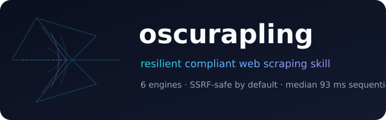
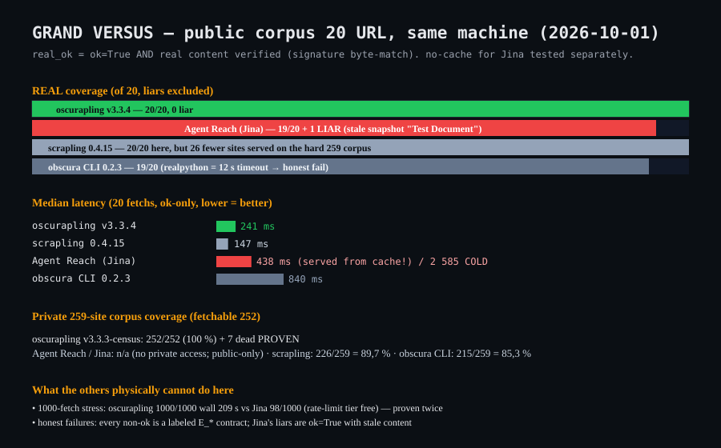

# oscurapling — resilient compliant web scraping skill for Claude



> **Legal notice — read [`DISCLAIMER.md`](DISCLAIMER.md) first.** Dual-use
> software, provided AS IS, no warranty; **you** are solely responsible for the
> lawfulness of your use in your jurisdiction (FR: art. 323-1/323-2 CP, LCEN,
> RGPD · US: CFAA, DMCA §1201, CCPA/CPRA, **BIPA** ($1k-5k/violation, private
> right of action), FTC §5, CAN-SPAM/TCPA — full table & honest limits in
> **Appendix A**). By using this repository you indemnify the author, accept
> **French law + arbitration + class-action waiver** (§11) and the
> **no-inducement clause (§12)**. 18+, no sanctioned parties. Not legal advice.
> Runtime enforcement: `scripts/accept_terms.py` requires an **affirmative,
> versioned, hash-pinned `I ACCEPT`** before the first fetch (browsewrap is
> unenforceable — the gate is not). Report abuse via a GitHub issue titled
> `[abuse]`.

A **Claude Agent Skill** (agentskills.io spec, as shipped in `anthropics/skills`) that turns the proven **oscurapling** scraping engine into deterministic agent judgment: when to use which engine, exactly what to do on every failure class, and how to stay compliant while doing it.

**Inspired by the best of both worlds:** [`scrapling`](https://github.com/D4Vinci/Scrapling) (stealth fetching, adaptive parsing) and [`obscura`](https://github.com/h4ckf0r0day/obscura) (CDP-grade rendering) — merged into a single routing engine with measured performance, then packaged as a skill following the conventions of the most-starred skill repos.

## Why this skill

| | Typical scraping skills | **oscurapling** |
|---|---|---|
| Engine | patterns & advice only | **6 real engines, routed by domain fingerprint** |
| Performance claims | none | **timestamped JSON bench artifacts you can re-run** |
| Failure handling | prose | **machine-readable error codes (`E_GATE_SSRF`, `E_DAEMON_STALE`…) with deterministic next actions** |
| Compliance | absent | **SSRF gates ON by default, robots honored, rate-limited, anti-bot opt-in only** |

Measured on the private 259-site real-world corpus (v3.3.3): **244/259 (96.8 % of fetchable; 7 dead domains proven by dual-DoH)**, median **93 ms sequential / 221 ms batch**, vs 1 097 ms for v3.2.0 — and versus reference engines on the same machine: scrapling 0.4.15 182 ms (median: 26 fewer sites served), obscura CLI 2 300 ms.



## Install

```bash
git clone https://github.com/boris21dd-sketch/oscurapling   # the engine (pinned v3.3.3)
git clone https://github.com/boris21dd-sketch/oscurapling-skill  # this skill
cd oscurapling-skill
ln -s ../oscurapling oscurapling   # or set PYTHONPATH to the engine dir
python -m venv .venv && source .venv/bin/activate
pip install -r requirements.txt
```

Then point Claude Code (or any Agent-Skills host) at this folder: the skill self-describes via `SKILL.md` frontmatter and is picked up automatically on relevant prompts ("scrape", "fetch this", "403 on that site", "batch of URLs").

## What Claude learns from the skill

- A **decision tree** for the 6-engine route (httpx → curl_cffi → obscura → invisible-fw → scrapling-stealth → fp-js), including honest degradation when Chrome is absent.
- A **failure contract**: every error class maps to exactly one next action. No improvisation on gates.
- **Compliance by reflex**: robots.txt, rate limits, never bypassing SSRF gates, prompt-injection defense when targets could come from scraped content.
- **Measured self-benchmark**: `scripts/bench.py` on a 20-URL public permissive corpus — publishable, PII-free, re-runnable.

## Skill contents

```
oscurapling-skill/
├── SKILL.md                     # the agent-facing instructions (<500 lines, english)
├── scripts/
│   ├── scrape.py                # stable CLI wrapper: fetch/batch, --json, E_* codes
│   └── bench.py                 # public-corpus benchmark runner
├── references/
│   ├── architecture.md          # 6-engine route, warm-pool multi-daemon, DNS proof
│   ├── pitfalls.md              # 10 measured pitfalls (zombie daemons, ETag cache…)
│   └── compliant-use.md         # responsible scraping policy + injection defense
├── benchmark/
│   ├── corpus_public.txt        # 20 permissive educational sites (NOT the private list)
│   └── bench_results.json       # last public run artifact (timestamped)
└── assets/
    ├── logo.svg
    └── bench.svg
```

## License

MIT for the skill. The pinned engine (private repo `oscuraplingfull` v3.3.3) is referenced, not redistributed here.

## Third-party notices & acknowledgment

- [Scrapling](https://github.com/D4Vinci/Scrapling) — **BSD 3-Clause**, © 2024 Karim Shoair (D4Vinci). The engine imports it as a declared dependency (`scrapling==0.4.15`: `Adaptor`, `StealthyFetcher`) and its stealth-fetching design directly inspired the `scrapling-stealth` rung. Its license notice is preserved via the dependency declaration.
- [Obscura](https://github.com/h4ckf0r0day/obscura) — **Apache License 2.0**, © h4ckf0r0day. The engine invokes the independently-installed binary (`--file`, `--dump markdown`, `--obey-robots`) as the CDP-grade rendering rung; its engineering directly inspired the daemon architecture.
- Both projects' names and marks are used for description and attribution only (nominative fair use); **neither endorses this project** — see `DISCLAIMER.md` §7.
- These notices satisfy their respective attribution requirements while the projects remain separate: this repository ships no copy of upstream source code, only imports/calls at their pinned versions.

*Numbers change with networks — re-run the bench, do not trust READMEs, verify.*